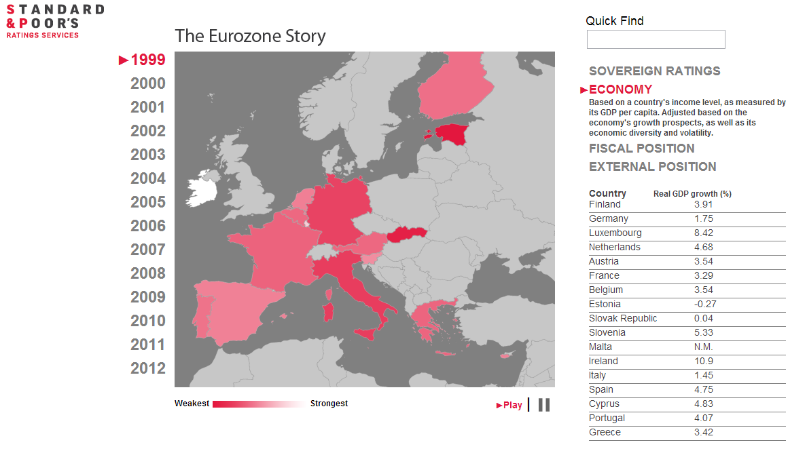

EU Story
=====

----------
The **S&P EU Story visualization** was created after the I had received some great reception from my S&P World View visualization application. As the name implies, this application focuses on Europe, specifically the inception of the Euro-zone in 1999 to 2012. 

I’ve broken down the analysis into 4 parts: Sovereign Ratings, Economic around GDP, the Fiscal Position and External position. Each of those sections can be analyzed over time separately by the color scale as well as a number of economic and fiscal indicators. 

#UI#

*Intern Project*